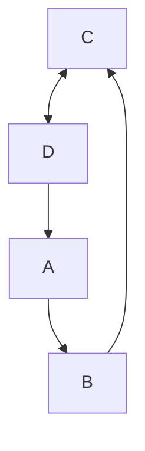

# elewe-n-jewe
### [Play Demo](https://atp-suitsup.netlify.app)

Popularly called *eléwé-ń-j'ewé* among the Yoruba people, SuitsUp! is a multiplayer (*2-4* opponents), turn-based card game in which you win opponent(s) by matching suits with the top card on the **foundation** pile.

A deck containing **52** cards is used.

**10** cards go to each participant, while the remaining cards can be purchased one at a time from the **market** pile.

When a participant wins, its score is calculated based on the number of cards currently on the foundation pile.

Purchase of a card from market pile costs 1 point

Game ends when:

1. opponent runs out of cards and no card remains in the market to purchase

2. one of the participants reaches a score of **70**;

There will be five difficulty modes:
- [ ] > easy
- [ ] > normal
- [ ] > hard
- [ ] > legend
- [x] > hell

There will be three options to choose from:
* Classic
    * this is how the game is originally played
* Race Against Time
    * player with the highest score after a specified timeframe wins
* First to 70
    * game ends when one of the players score 70 points
